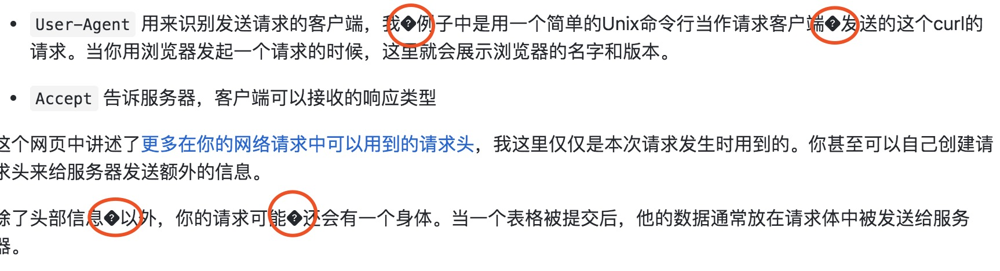
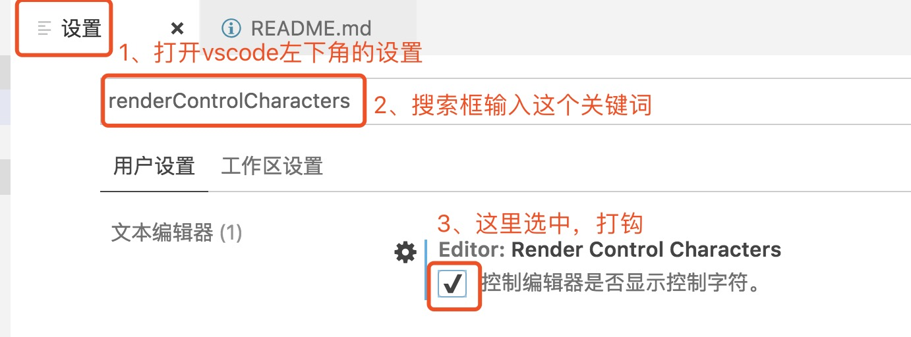
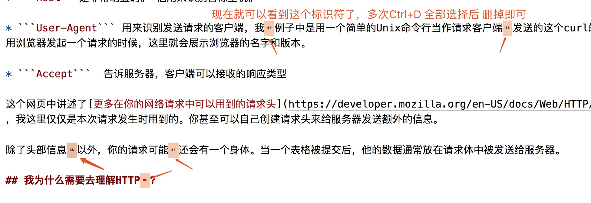

# 文档翻译
外文技术博文翻译

[wiki](https://github.com/xingorg1/To-translate-documents/wiki)

## 目录
分类 | 文档 |关键词| 译者 | 时间
:--: | :--: |:--:| :--: | :--:
http | 1. [【译】为什么要了解HTTP](./http/为什么要了解HTTP.md) |HTTP ,BEGINNERS| @xing.org1^ | 20190809-20190824
-- | -- | --

## 分支命名规则
主分支名_主要内容关键词_作者名首字母_年月日  
比如：master_http_gjf_20190809

## 遇到的问题
### 1、markdown乱码问题
mac写完window写，不知道是不是期间换过电脑的原因，中间md文件出现了乱码，第一次遇到。

但是我vscode本地看没问题，传到github就展示下边这样：

然后百度了下解决方法如下：
主要问题出在了vscode编写时有了控制代码，但是我们一般看不到，因为他是隐藏的，所以我们需要通过设置把隐藏的这个控制符展示出来，设置步骤如下：

此时，我们再打开md文件，就能看到控制符了，把他删掉：

## 感谢
自发组织的自愿文档翻译行动，欢迎感兴趣的大佬可以加入一同携手进步！也恳求英语大佬指导我写的不对的地方。