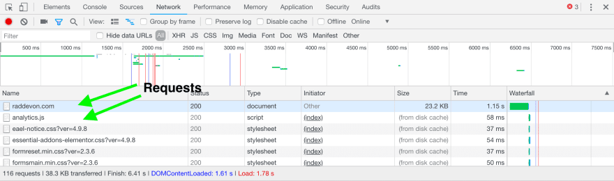
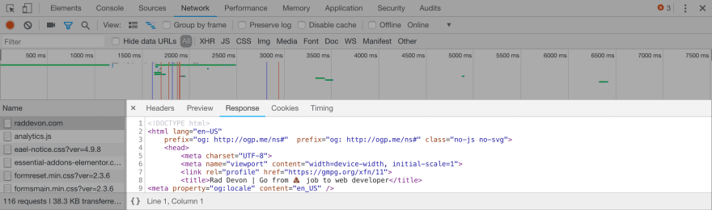
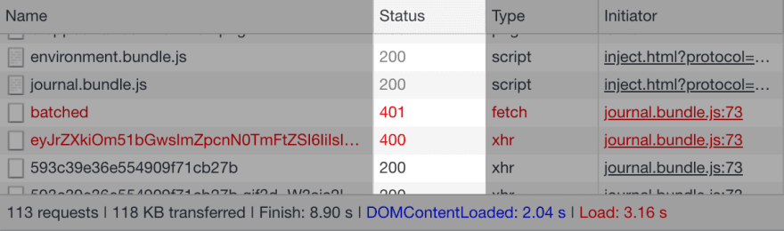

# Why should I care about HTTP?
The original address：[Why should I care about HTTP?](https://dev.to/raddevon/why-should-i-care-about-http-2em3)  
The original information：by [Devon Campbell](https://dev.to/raddevon). Dec 15 '18 Originally published at raddevon.com on Dec 14, 2018  
keyword：HTTP ,BEGINNERS
*** 
HTTP are the four letters at the beginning of your URLs, right? That’s all you really have to know about it to build for the web, but, just like [understanding binary](https://raddevon.com/articles/the-basics-of-binary-and-other-number-systems-for-web-developers/), it can help you understand problems you otherwise wouldn’t. It’s not required material, but it makes you a more well-rounded developer.  

Since it’s the primary communication protocol our software will be using, let’s learn a little about HTTP!


## What is HTTP?
HTTP stands for hypertext transfer protocol. That’s a set of rules (protocol) for sending and receiving (transfer) web pages (hypertext). Even though it’s still called HTTP, it’s now used for sending lots of things besides hypertext — for example, JSON and images.


## How does HTTP work?


HTTP communication happens between a client and a server. The client makes the HTTP request, and the server responds to it. Your web browser is an HTTP client. When you visit a web page, your browser sends an HTTP request to a server which sends a response. It’s (almost) that simple.


Actually, a single web page is usually comprised of multiple requests. What usually happens is a request is made for some HTML, and the server responds with the HTML. The browser starts rendering the HTML and makes additional requests for any other resources it needs to render the page — like Javascript files, CSS files, and images.


## Parts of a Request

Here’s what a raw request to RadDevon.com for the home page looks like:


```
GET / HTTP/2
Host: raddevon.com
User-Agent: curl/7.54.0
Accept: */*
```

When you type raddevon.com into your address bar and press return, your browser sends this request to my host. Here are the parts:


* ```GET``` – The request method. It tells the server what the request is intended to do. This request wants the server to send back some data. MDN has a nice request method reference.  


* ```/``` – The resource we’re requesting. Since the homepage is at the root of the server, that’s the resource we’re requesting here.


* ```HTTP/2``` – The protocol. This particular request is made using version 2 of HTTP.

* The other three lines are headers. These give the receiving server additional information about this request.  
  * ```Host``` is pretty obvious. It identifies the target host.  

  * ```User-Agent``` identifies the client sending the request. I sent this one using cURL which is a simple Unix command line HTTP client. When you make a request with a browser, this will show the name of the browser and the version.  

  * ```Accept``` tells the server which types of responses the client can receive.

There are [other headers you can use in your requests](https://developer.mozilla.org/en-US/docs/Web/HTTP/Headers). These are just the ones this request happens to use. You can even create your own headers to send additional info to the server.

Beyond headers, your request might also have a body. When a form is submitted, that data is usually sent to the server in the request body.

## Why do I need to understand HTTP?

Understanding how HTTP works, and, particularly, understanding the various response status codes and what they mean helps you **debug your applications** and **handle errors appropriately**. Knowing that each resource used on your pages (scripts, images, stylesheets, etc.) represents a separate request can also help you **make your applications more performant**.

> Is this helping you? My goal is to help people transition into web development careers. 🤬🔜🤩 Sign up for a free mentoring session at [Rad Devon](https://raddevon.com/), and I'll help you figure out your next steps.

Here’s how you can look at the requests the browser is making for your application. Your browser’s developer tools will show you all the requests, the response statuses, and even the request headers and the response body. Here’s an example viewing the requests Chrome makes for RadDevon.com in the Chrome developer tools “Network” tab:



When you first switch to the "Network" tab, it may be empty. Just refresh and it will capture all the requests as the page reloads.

Each row represents a request the browser made to render this page. If you click the request, you’ll see several tabs with more information about that request. Here’s the response tab for the main request that returns the HTML of the Rad Devon homepage:



## How do requests impact performance?

The time it takes a request to complete is the sum of time time it takes the request to get to the server, the time for the server to prepare the response, and the time for the response to get back. Each request has some overhead beyond the time it takes for the data you requested to come back. **If you can reduce the sizes of your resources and the number of requests, you can reduce the amount of time it takes to load your page.**

Imagine you’re helping someone bake a cake. You’ve offered to be their “runner” and get them all the things they need while they focus on baking. They start by asking you to get flour. You walk over to the cabinet, grab the flour, and bring it back.

Next, they ask you for cocoa powder. You go back to the cabinet, slightly annoyed, grab the cocoa powder, and bring it to them. Now, they ask you for baking powder. OK, this is getting a little ridiculous. Wouldn’t it be nice if they just asked you for all the things they need from the cabinet, and you could grab them all in a single trip?

Bingo. Even though it might take you a little longer to get back to them with all the items since they’re a little heavier, it’s a lot quicker than making three trips. You could also make the process faster if you’re grabbing just the amount of each item they need instead of lugging over a 5-pound bag of each. If it turns out they don’t need the cocoa powder at all, that’s going to speed things up too!

This is the same approach you might take when optimizing for performance in your web application. Try these optimizations in order:

1. **Eliminate unnecessary requests** by dropping any images or scripts you don’t absolutely need.

2. **Reduce weight** by optimizing images and minifying code.  

3. **Reduce the number of requests** by concatenating all Javascript and CSS into a single file each.

Check out the “Time” column in your developer tools to understand which requests are making your page slow.

Understanding HTTP doesn’t just help with performance. It can also make your app more usable and make it easier to debug. When your application is not behaving as expected, it can be because of a problem with a request. That makes being able to understand what the “Network” tab is showing you valuable for debugging. The **HTTP status code** is a great place to start.

## What are HTTP status codes?

HTTP status code are returned to the HTTP client by the server along with the rest of the response. They inform the client **whether the request succeeded** and, if it failed, give some information about why. Here’s what they look like in Chrome developer tools:



The status code is a three-digit number. Here are the ranges and what each one means:

* **100–** Responses in the 100s are described as “informational responses.” I personally have never seen one of these response codes in the wild. I’m sure they’re out there, but I doubt they’re very common.

* **200–** This was a successful request with no caveats. If you asked the server to do something, it did it. If you asked for some data, it returned it.

* **300–** Your request was redirected. This response is probably still fine because the server knew the location of the resource you requested… even though it wasn’t where you thought it was.

* **400–** The 400 range are client errors. That means something in the request was not what the server expected. Maybe you sent a URL parameter that isn’t supported for the endpoint you made the request to. You probably won’t get back anything useful in the response body if the code is in the 400s.

* **500–** The 500 range are server errors. The request was fine, but something broke on the server. Like the 400 range, you probably won’t get back any useful data on a 500.

That covers the ranges, but **each status code inside those ranges has a more specific meaning**. MDN has a great article running down [the meaning of each response code](https://developer.mozilla.org/en-US/docs/Web/HTTP/Status). This can help you narrow even further the issues you’re having with your application. It can also help you **handle unsuccessful requests** in your application more intelligently.

For example, if a request comes back with a 400 because your user entered invalid data into a form which was then passed on to an API via a parameter, you might want to display an error message that tells them how to provide valid data. On the other hand, if you get a 500 error meaning something bad happened on the server, there’s probably nothing your user can do to make that right.

### Why status codes aren't always reliable

Understanding status codes can be useful for debugging and for writing your application to handle errors. The problem is that **they aren’t always reliable**. Here’s why.

When writing server-side code, developers have full discretion to choose the error code that makes sense to them. The descriptions above are what each range is supposed to mean, but that doesn’t mean they’re implemented this way in every application. In fact, they are not.

You may get a 500 response with useful data in the body, or you may get a 200 back with an error message. **Each application is a unique snowflake**, so make sure you know what will actually come back when you’re writing your front-end code.

## Quick Wins from Understanding HTTP

Even if you’ve been building for the web *without* an understanding of HTTP, it’s still worthwhile to gain at least a cursory understanding. You’ll have **better tools to improve performance**, you can **easily handle errors** coming back from the server, and you can **debug problems** that might have otherwise eluded you.

It’s a nice suite of benefits in exchange for a bit of reading and some poking around in your browser’s developer tools.


***
### The author information


**[Devon Campbell](https://dev.to/raddevon)**  
I help people leave their 💩 jobs to become web developers.

[@raddevon](https://dev.to/raddevon)   [twitter](http://twitter.com/raddevon)   [github](http://github.com/raddevon)   [raddevon.com](https://raddevon.com/)